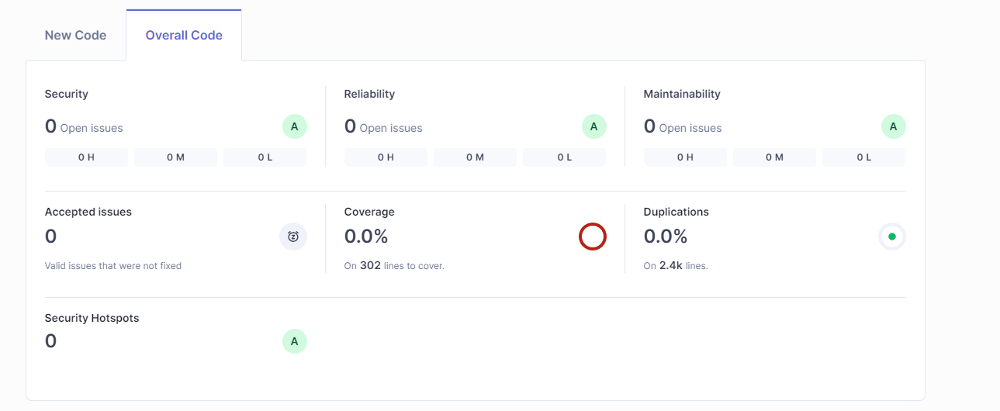

# 42 User Information 

## Introduction
42UserInfo is a mobile application that allows users to access their 42 information and statistics. With features such as user authentication, data visualization and an intuitive interface.

## Technologies Used
- **Kotlin**: The primary programming language for Android development.
- **Hilt**: Dependency injection for Android.
- **Retrofit**: For network operations and API interactions.
- **Jetpack Compose**: For the creation of modern and declarative user interfaces.
- **SonarQube**: For continuous inspection of code quality and security.

## Requirements
- **Android Studio**: Make sure you have the latest version of Android Studio installed.
- **Belong to 42**: You need to have a client_id and a client_secret to be credited to the application.

## Installation
To set up the 42UserInformation project locally, follow these steps:

1. Open Android Studio
2. New > Project from version control > https://github.com/AntonioJesusRM/42UserInfo.git
3. Add client_id and client_secret to secrets.properties file
4. Sync the Gradle files.
5. Build and run the app on an emulator or physical device.

## Usage
Once the application is running, users can:

- Login with your 42 account.
- See your user data.
- See your Skills.
- See your completed projects.
- Close your session.

## Code Quality
Here is a screenshot of the SonarQube analysis for the 42UserInfo project:

